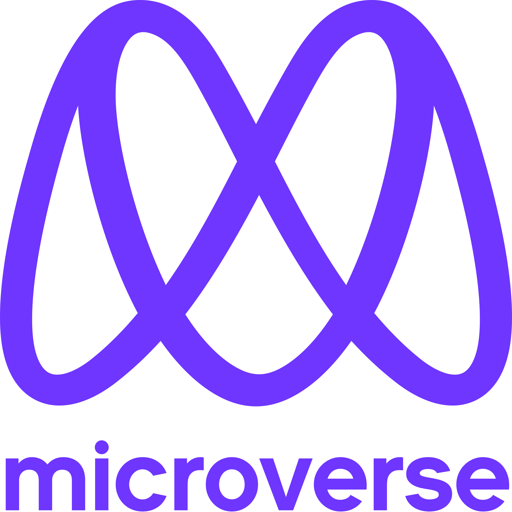

  <!-- You are encouraged to replace this logo with your own! Otherwise you can also remove it. -->
  
   

  <h3><b>Portfolio README Template</b></h3>

<!-- TABLE OF CONTENTS -->

# 📗 Table of Contents

- [📖 About the Project](#about-project)
  - [🛠 Built With](#built-with)
    - [Key Features](#key-features)
  - [🚀 Live Demo](#live-demo)
- [👥 Authors](#authors)
- [🔭 Future Features](#future-features)
- [🤝 Contributing](#contributing)
- [⭐️ Show your support](#support)
- [🙏 Acknowledgements](#acknowledgements)
- [❓ FAQ](#faq)
- [📝 License](#license)

<!-- PROJECT DESCRIPTION -->

# 📖 [porfolio] <a name="about-project">https://github.com/Amazinggracee/Portfolio</a>

Portfolio: desktop version.

# 📖 [Online link porfolio] <a name="about-project">https://amazinggracee.github.io/Portfolio/</a>

In this project, I built the desktop version of my portfolio using media query:
- [ ] Use basic JavaScript syntax.
- [ ] Use JavaScript to manipulate DOM elements.
- [ ] Use JavaScript events.
- [ ] Make sure that there are no linter errors.
- [ ] Make sure that you used the correct GitHub flow.
- [ ] Make sure that you documented your work in a professional way.
- [ ] Follow our list of best practices for HTML & CSS.
- [ ] Follow our list of best practices for JavaScript.
- [ ] In mobile, implement the following features:
> - [ ] When the user clicks (or taps) the hamburger button, the mobile menu appears.
> - [ ] When the user clicks (or taps) the close (X) button, the mobile menu disappears.
> - [ ] When the user clicks (or taps) any of the mobile menu options, the mobile menu    disappears.
> - [ ] When the user clicks (or taps) any of the mobile menu options, a correct part of the page is displayed.

Portfolio project is a project about me as a Website developer, the projects I have handled and also hoe to contact me when you need my services.

# 🛠 Built With <a name="built-with">HTML and CSS</a>

## Tech Stack <a name="tech-stack">HTML and CSS</a>

### Tech Stack <a name="tech-stack">HTML, CSS and, JavaScript </a>

The entire project was built with only HTML5 and CSS3.

<!-- Features -->

### Key Features 

- **[key_feature_1]** My Porfolio, built with CSS and Html.
- **[key_feature_2]** Portfolio: Mobile Version.
- **[key_feature_3]** Portfolio: Desktop Version.
- **[key_feature_4]** Portfolio: accessibility.
- **[key_feature_5]** Portfolio: Portfolio - mobile menu with javaScript.

(<a href="#readme-top">back to top</a>)

<!-- LIVE DEMO -->

## 🚀 Live Demo 

- [Live Demo Link](https://amazinggracee.github.io/Portfolio/)

(<a href="#readme-top">back to top</a>)

<!-- GETTING STARTED -->

## 💻 Getting Started <a name="getting-started">Portfolio Repository</a>

This will guide one on how to make responsive Portfolio that is accessible with any screen size.

Accessibility List:

List all points that you have checked, i.e:
1. Page titles
2. Image text alternatives** ()
3. Text headings
4. Color contrast
5. Resize
6. Interaction (labels are optional but recommended as voiceover tools can read them, and should be set as invisible to match the Figma design)
7. Moving content
8. Multimedia
9. The basic structure of the page

### Prerequisites

In order to run this project you need: 
1. A computer with a code writer, I recommend Visual Studio Code.
2. A pre-knowledge of HTML, CSS and, JavaScript.

<!-- AUTHORS -->

## 👥 Authors <a name="authors">Amarachi Dimkpa</a>

👤 **Author1**

- GitHub: [@amazinggacee](https://github.com/Amazinggracee)
- Twitter: [@amazinggaceu](https://twitter.com/amazinggraceu)
- LinkedIn: [Amarachi Dimkpa](https://linkedin.com/in/amarachi-dimkpa-070643183)

 👤 **Author2**

- GitHub: [@tsheporamantso](https://github.com/tsheporamantso)
- Twitter: [@ramgt001](https://twitter.com/home)
- LinkedIn: [Tshepo Gladwin Ramantso](https://www.linkedin.com/in/tshepo-ramantso-b6a35433/)

 👤 **Author3**

- GitHub: [@PowerLevel9000](https://github.com/PowerLevel9000)
- Twitter: [@PowerLevel9002](https://twitter.com/PowerLevel9002?t=AIuSN7mTxk5a_MWpLolEjA&s=09)
- LinkedIn: [Adarsh pathatk](https://www.linkedin.com/in/adarsh-pathak-56a831256/)

 👤 **Author4**

- GitHub: [@Bigizi](https://github.com/Bigizi)
- LinkedIn: [Bigizi Nduwayo Crispin](https://www.linkedin.com/in/bigizi-nduwayo-crispin-74b534227/)

(<a href="#readme-top">back to top</a>)

<!-- FUTURE FEATURES -->

## 🔭 Future Features 

- [ ] **[new_feature_1]** More CSS Animations 
- [ ] **[new_feature_2]** More JavaScript functionalities

(<a href="#readme-top">back to top</a>)

<!-- CONTRIBUTING -->

## 🤝 Contributing 

Contributions, issues, and feature requests are welcome!

Feel free to check the [issues page](https://github.com/Amazinggracee/Portfolio/issues/).

(<a href="#readme-top">back to top</a>)

<!-- SUPPORT -->

## ⭐️ Show your support 

If you like this project feel free to go through it and comment.

(<a href="#readme-top">back to top</a>)

<!-- ACKNOWLEDGEMENTS -->

## 🙏 Acknowledgments 

> Give credit to everyone who inspired your codebase.

I would like to thank Microverse Students that I have collaborated with since I started this journey. 

(<a href="#readme-top">back to top</a>)

<!-- FAQ (optional) -->

## ❓ FAQ 

> Add at least 2 questions new developers would ask when they decide to use your project.

- **[Question_1]**

  - [Answer_1]

- **[Question_2]**

  - [Answer_2]

(<a href="#readme-top">back to top</a>)

<!-- LICENSE -->

## 📝 License 

This project is [MIT](./LICENSE) licensed.

_NOTE: we recommend using the [MIT license](https://choosealicense.com/licenses/mit/) - you can set it up quickly by [using templates available on GitHub](https://docs.github.com/en/communities/setting-up-your-project-for-healthy-contributions/adding-a-license-to-a-repository). You can also use [any other license](https://choosealicense.com/licenses/) if you wish._

(<a href="#readme-top">back to top</a>)

